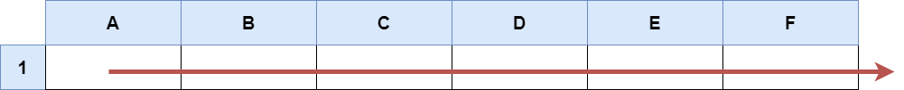

## LeetCode 2194. Cells in a Range on an Excel Sheet


#### Question
A cell (r, c) of an excel sheet is represented as a string "<col><row>" where:

* <col> denotes the column number c of the cell. It is represented by alphabetical letters.
    For example, the 1st column is denoted by 'A', the 2nd by 'B', the 3rd by 'C', and so on.
* <row> is the row number r of the cell. The rth row is represented by the integer r.

You are given a string s in the format "<col1><row1>:<col2><row2>", where <col1> represents the column c1, <row1> represents the row r1, <col2> represents the column c2, and <row2> represents the row r2, such that r1 <= r2 and c1 <= c2.

Return the list of cells (x, y) such that r1 <= x <= r2 and c1 <= y <= c2. The cells should be represented as strings in the format mentioned above and be sorted in non-decreasing order first by columns and then by rows.

<p>&nbsp;</p>

**Example 1:**


    Input: s = "K1:L2"
    Output: ["K1","K2","L1","L2"]
    Explanation:
    The above diagram shows the cells which should be present in the list.
    The red arrows denote the order in which the cells should be presented.

<p>&nbsp;</p>

**Example 2:**



    Input: s = "A1:F1"
    Output: ["A1","B1","C1","D1","E1","F1"]
    Explanation:
    The above diagram shows the cells which should be present in the list.
    The red arrow denotes the order in which the cells should be presented.

<p>&nbsp;</p>


**Constraints:**


* s.length == 5
* 'A' <= s[0] <= s[3] <= 'Z'
* '1' <= s[1] <= s[4] <= '9'
* s consists of uppercase English letters, digits and ':'.


<p>&nbsp;</p>

---

<p>&nbsp;</p>  

#### Solution
**Python**
```Python
class Solution:
    def cellsInRange(self, s: str) -> List[str]:
        list_s = list(s)
        letters = []
        numbers = []
        new_s = []
        for i in range(ord(list_s[0]),ord(list_s[3])+1):
            letters.append(chr(i))
        for j in range(int(list_s[1]),int(list_s[-1])+1):
            numbers.append(str(j))
        for i in letters:
            for j in numbers:
                new_s.append(i+j)

        return new_s
```

**Java**