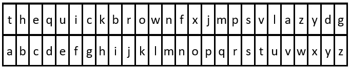

## LeetCode 2325. Decode the Message


#### Question
You are given the strings key and message, which represent a cipher key and a secret message, respectively. The steps to decode message are as follows:

Use the first appearance of all 26 lowercase English letters in key as the order of the substitution table.

Align the substitution table with the regular English alphabet.

Each letter in message is then substituted using the table.

Spaces ' ' are transformed to themselves.

* For example, given key = "happy boy" (actual key would have at least one instance of each letter in the alphabet), we have the partial substitution table of ('h' -> 'a', 'a' -> 'b', 'p' -> 'c', 'y' -> 'd', 'b' -> 'e', 'o' -> 'f').

Return the decoded message.

<p>&nbsp;</p>

**Example 1:**



    Input: key = "the quick brown fox jumps over the lazy dog", message = "vkbs bs t suepuv"
    Output: "this is a secret"
    Explanation: The diagram above shows the substitution table.
    It is obtained by taking the first appearance of each letter in "the quick brown fox jumps over the lazy dog".

<p>&nbsp;</p>

**Example 2:**


    Input: key = "eljuxhpwnyrdgtqkviszcfmabo", message = "zwx hnfx lqantp mnoeius ycgk vcnjrdb"
    Output: "the five boxing wizards jump quickly"
    Explanation: The diagram above shows the substitution table.
    It is obtained by taking the first appearance of each letter in "eljuxhpwnyrdgtqkviszcfmabo".

<p>&nbsp;</p>


**Constraints:**


* 26 <= key.length <= 2000
* key consists of lowercase English letters and ' '.
* key contains every letter in the English alphabet ('a' to 'z') at least once.
* 1 <= message.length <= 2000
* message consists of lowercase English letters and ' '.


<p>&nbsp;</p>

---

<p>&nbsp;</p>  

#### Solution
**Python**
```Python
class Solution:
    def decodeMessage(self, key: str, message: str) -> str:
        # format key
        list_key = list(key)
        while ' ' in list_key:
            list_key.remove(' ')
        list_key2 = sorted(set(list_key), key = list_key.index)

        # format message
        list_message = list(message)

        # create an alphabet list
        list_original = [chr(i) for i in range(97,123)]

        for k in range(len(list_message)):
            if list_message[k] == ' ':
                continue            
            else:
                list_message[k] = list_original[list_key2.index(list_message[k])]

        return ''.join(list_message)
```

**Java**