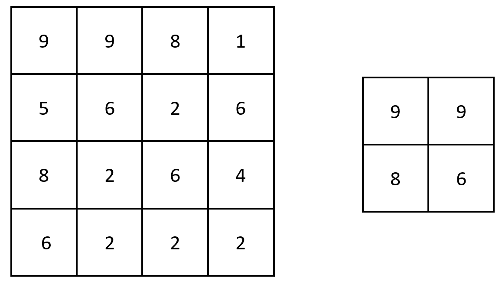

## LeetCode 2373. Largest Local Values in a Matrix


#### Question
You are given an n x n integer matrix grid.

Generate an integer matrix maxLocal of size (n - 2) x (n - 2) such that:

* maxLocal[i][j] is equal to the largest value of the 3 x 3 matrix in grid centered around row i + 1 and column j + 1.

In other words, we want to find the largest value in every contiguous 3 x 3 matrix in grid.

Return the generated matrix.

<p>&nbsp;</p>

**Example 1:**



    Input: grid = [[9,9,8,1],[5,6,2,6],[8,2,6,4],[6,2,2,2]]
    Output: [[9,9],[8,6]]
    Explanation: The diagram above shows the original matrix and the generated matrix.
    Notice that each value in the generated matrix corresponds to the largest value of a contiguous 3 x 3 matrix in grid.

<p>&nbsp;</p>

**Example 2:**


    Input: grid = [[1,1,1,1,1],[1,1,1,1,1],[1,1,2,1,1],[1,1,1,1,1],[1,1,1,1,1]]
    Output: [[2,2,2],[2,2,2],[2,2,2]]
    Explanation: Notice that the 2 is contained within every contiguous 3 x 3 matrix in grid.

<p>&nbsp;</p>

**Example 3:**

    Input: nums = [7,7,7,7]
    Output: [0,0,0,0]

<p>&nbsp;</p>


**Constraints:**


* n == grid.length == grid[i].length
* 3 <= n <= 100
* 1 <= grid[i][j] <= 100


<p>&nbsp;</p>

---
  

#### Solution
**Python**
```Python
class Solution:
    def largestLocal(self, grid: List[List[int]]) -> List[List[int]]:
        n = len(grid)
        res = [[0 for _ in range(0,n-2)] for _ in range(0,n-2)]

        for i in range(n-2):
            for j in range(n-2):

                best = grid[i + 1][j + 1] 
                for ii in range(i, i +3 ):
                    for jj in range(j, j +3):
                        best = max(best,grid[ii][jj])
                res[i][j] = best
        return res
```

**Java**